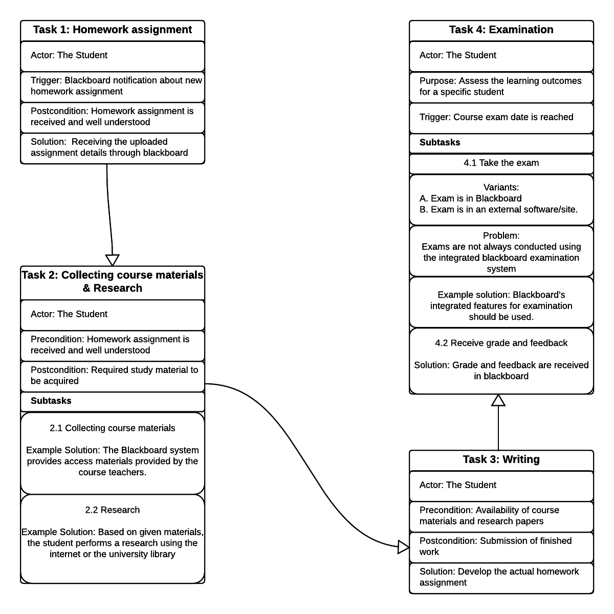
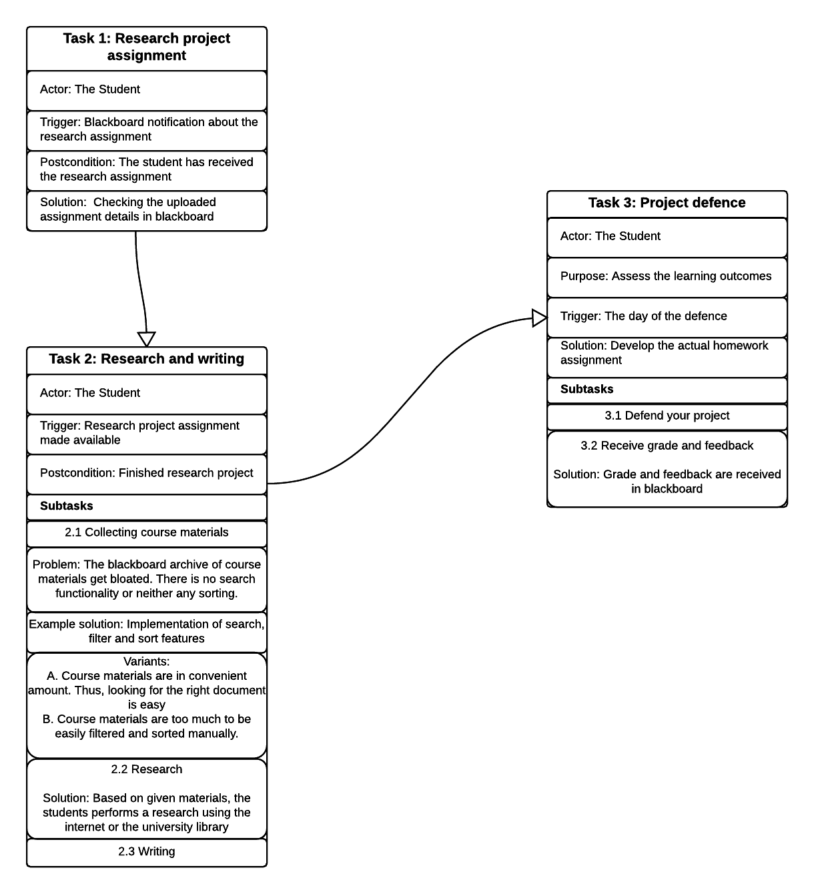

# Interviews week 1 - interesting findings and effective questions

## Introduction
For the first set of intereviewed about blackboard we stumbled accross students from the following specialities:
 - Business Analytics 
 - Physics 
 - Psychology

Althought that considerable part of the intervewed students claimed that they are satasfied from the service provided by blackboard there were valuable points stating the opposite. 

## Keypoints
Sorted by priority, the following keypoints were reported during the interview as domains of necessary improvement.

### Lack of search functionality
The largest group of interviewed students complained that they find it difficult to locate course materials when the amount of such is too high. In addition, no sorting/filtering is available in the very same section. 

### Usage of 3rd party software
Students reported that teachers frequently use 3rd party software services. Some of the cases, they claim, include file sharing systems (such as Dropbox). Probably shared files were too large for the capacity allowed by blackboard. Furthermore, one psychology student stated that her _Statistics and arguments_ teacher used an external SaaS for surveys and questionairs. What makes this particular case curious is the fact that blackboard actually supports surveys. One possible reason behind this might be the lack of informativity about the available features in blackbord. However, it is not yet clear if this is specifically related to poor UI/UX design, or rather lack of knowledge database. 

### Intergration with the rest of the UvA services and sites
The psychology student stated that she sees as a disatvantage the lacking feel of single access point for everything related to the education. For example, timetables are handled by another service, as course enrolements too.

### Poor UI and issues
Very few from the interviewed actually addressed the UI as having a major negative impact. What was mostly mentioned, however, were possible improvements on the easy-to-access capabilities. In addition, the four physics students claimed that they were experiecing bugs and issues with the notification updates.

### Task Models

#### Psychology homework

#### Physics research project

## Conclusions 
From the collected feedback, it seems that students are not having any critical issues with the usage of blackboard. Furthermore, the current reported problems can be patched rather than enforcing rebuild of the whole system. However, some domains such as the integration with the orbiting UvA services can motivate the creation of a new platform.
