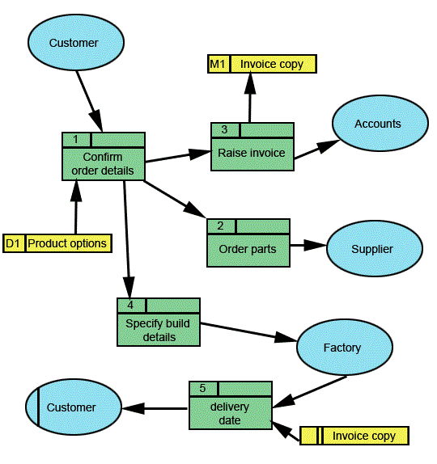
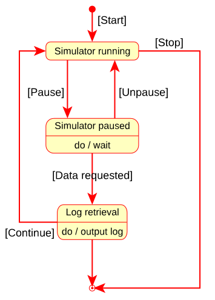
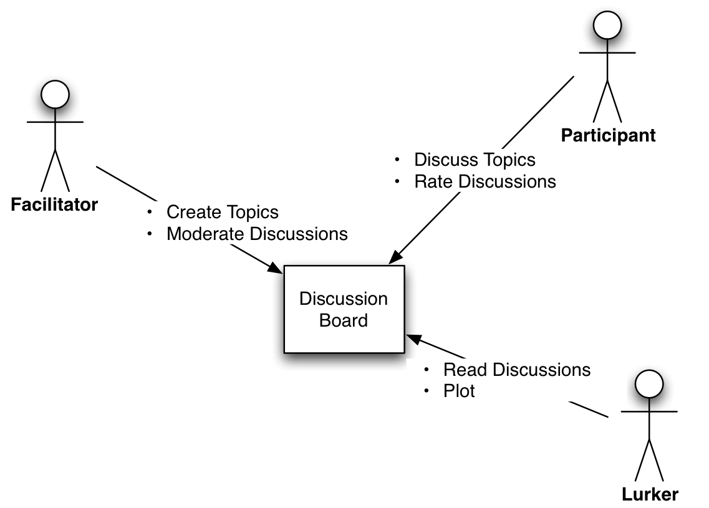
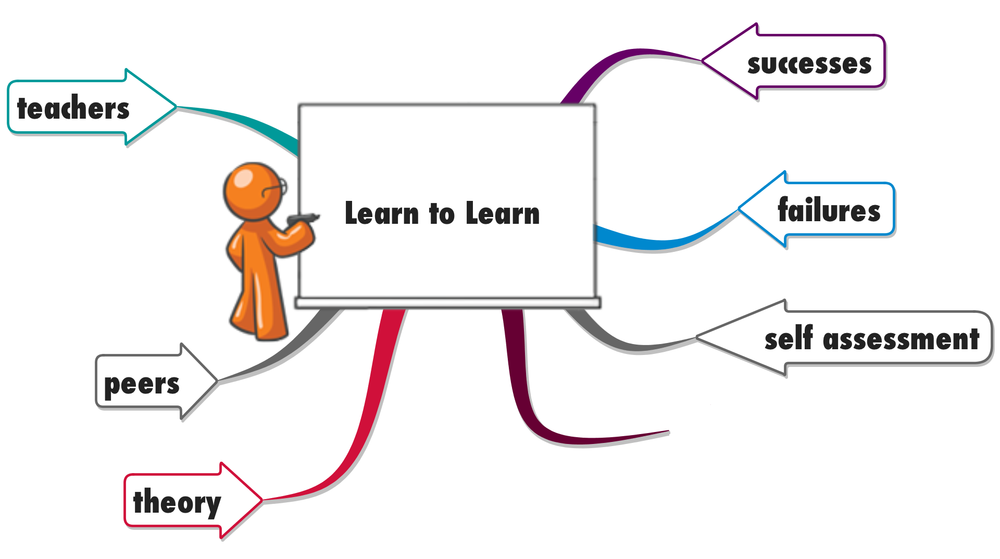

## Browse the web to find three modelling techniques you can use in requirements engineering that you have never seen or used before. Find an example in which these are used.

The following are just a few, modelling techniques used in requrements engineering:
- Data Flow Diagram (DFD) - perfect for an abstract system overview, which can be elaborated in later phases. Example:

 
- State diagram/State machine diagram - a perfect tool for clearly reasoning about the steps in complicated processes. Example:

- System context diagram - provides a high level view of the system, show the entities that the system interacts with in its' enviorment.

## What are good models for organising the knowledge about the successor of Blackboard
See next answer.

## How do you manage your data in such a way you are able to quickly restructure it, given you have new knowledge and insights.

An excellent approach for graphically recording and organising ideas is mindmapping. Personally I find it an excellent way to organise big amounts of data.

A god article about, mindmapping: [The Student’s Guide to Mind Mapping](http://www.mindmeister.com/blog/2013/09/17/the-students-guide-to-mind-mapping/)

Example mind map:

